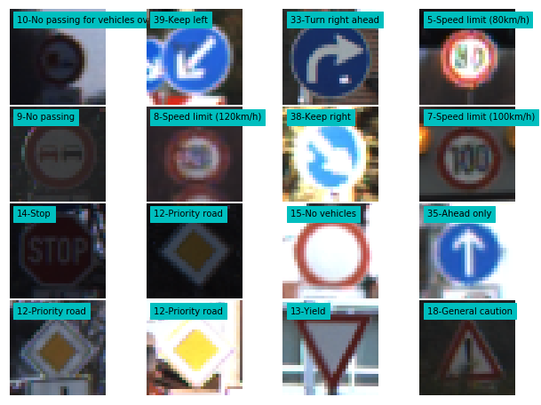

Please refer to ``.submissions/`` directory for a jupyter notebook with the final model.

---

## Step 1: German Traffic Signs Dataset Summary & Exploration

The pickled data is a dictionary with 4 key/value pairs:

- `'features'` is a 4D array containing raw pixel data of the traffic sign images, (num examples, width, height, channels).
- `'labels'` is a 1D array containing the label/class id of the traffic sign. The file `signnames.csv` contains id -> name mappings for each id.
- `'sizes'` is a list containing tuples, (width, height) representing the original width and height the image.
- `'coords'` is a list containing tuples, (x1, y1, x2, y2) representing coordinates of a bounding box around the sign in the image. **THESE COORDINATES ASSUME THE ORIGINAL IMAGE. THE PICKLED DATA CONTAINS RESIZED VERSIONS (32 by 32) OF THESE IMAGES**


### Basic Summary of the Data Set


    Number of training examples = 39209
    Number of testing examples = 12630
    Image data shape = (32, 32, 3)
    Number of classes = 43


Next, split the data train data, retaining 60% for training. Split leftout 40%
data into 50%:50%  validation and development sets. This would help reduce
overfitting to validation set. Here are the sizes of datasets after split:


    train shape (23525, 32, 32, 3)
    dev shape (7842, 32, 32, 3)
    valid shape (7842, 32, 32, 3)


Here is a visualization of frequency of examples per label in each of the
datasets: train, validation, dev, test. Visually make sure all the datasets have similar distribution of labels.


Random images visualized from training set, overlayed are the
labels:


Random images visualized from testing set, overlayed are the
labels:




----

## Step 2: Model


### Pre-process the Data Set

Images are preprocessed with histogram equalization and
min max scaling. Here are randomly chosen preprocessed images
from training set:


same preprocessing applied to test images:


Finally the images in training data are shuffled before
starting the training.

### Model Architecture


```python
EPOCHS = 10000
BATCH_SIZE = 256
N_CLASSES = 43
COLOR_CHANNELS = 3


```

## Model Architecture

model architecture is based on LeNet-5.

**Layer 1: Convolutional.**
apply convolution with 5x5 kernel, 'Valid' padding  and stride of 2 with output shape --> (28, 28, 32)

**Activation.**
ReLU.

**Pooling.** apply max pooling with 'Valid' padding and stride of 2,
output shape --> 14x14x32.

**Layer 2: Convolutional.**
Apply convolution with 5x5 kernel, 'Valid' padding and stride of 2 with output shape --> (10, 10, 64)

**Activation.** ReLU.

**Pooling.** Max pooling with 'Valid' padding and stride of 2,
output shape --> (5, 5, 64).

**Flatten.** Flatten the output shape of the final pooling layer such that it's 1D instead of 3D.
output shape --> 5*5*64 = 1600

**Layer 3: Fully Connected.**  maps 1600 inputs to 512 outputs. Dropout probability of 0.5.

**Activation.** ReLU.

**Layer 4: Fully Connected.** maps 512 inputs to 512 outputs. Dropout probability of 0.5.

**Activation.** ReLU.

**Layer 5: Fully Connected (Logits).** output logits of shape 43 corresponding to 43
traffic signs.

The code for calculating the accuracy of the model is located in the ninth cell of the Ipython notebook.


After 62 epochs, training accuracy of 0.999, validation accuracy of 0.991, with AvgEpochTime 21.95 s, and  TotalTime 22.68 min, is achieved. The model is trained with NVIDIA 740M gpu.


On additional held out data, previously referred to as development set, an accuracy of 0.989 is achieved.
At this point, with enough validation confidence, evaluate model on test images.

On the test set, an accuracy of  0.948 is achieved.


here are some visualizations of activations for convolutional layers:

---

convolution layer 1 visualization from test data:


---

convolution layer 2 visualization from test data


---

## Step 3: Test a Model on New Images

### Load and Output the Images

5 new German traffic signs images downloaded from the internet:


After applying same preprocessing to the new images:


Top 5 predictions on new images:


### Analyze Performance

0% accuracy achieved on new images.

---

## Step 4: Visualize the Neural Network's State with Test Images


### Visualize the activations of convnet layers on new images


    stop.jpeg


    speed-limit-60.jpeg


Above visualizations show that the activations have learnt relevant features from images.
